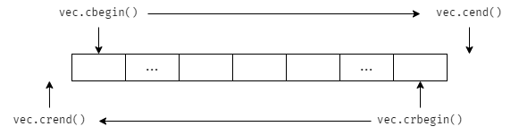
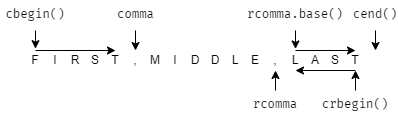

# 10.4 再探迭代器

* 插入迭代器（insert iterator）：将该迭代器绑定到容器上，可用来向容器插入元素
* 流迭代器（stream iterator）：将该迭代器绑定到输入/输出流上，可用来遍历关联的 I/O 流
* 反向迭代器（reverse iterator）：该迭代器自增时向后运动，而非向前运动，除了 forward_list 以外的标准库容器都有反向迭代器
* 移动迭代器（move iterator）：该迭代器不是拷贝其中的元素，而是移动它们

## 10.4.1 插入迭代器

插入迭代器的类型：

* `back_inserter` ：创建一个使用 push_back 的迭代器
* `front_inserter` ：创建一个使用 push_front 的迭代器
* `inserter` ：创建一个使用 inserter 的迭代器。此函数接受第二个参数，该参数是指向给定容器的迭代器。元素将被插入到给定迭代器所表示的元素**之前**

*只有支持 push_back 的容器才能使用 back_inserter 。*  
*只有支持 push_front 的容器才能使用 front_inserter 。*

插入迭代器的操作：

* `it = t` ：假设 c 是 it 绑定的容器，赋值操作等价于 `c.push_back(t)` 、`c.push_front(t)` 或 `c.insert(t, p)` ，其中 p 为传递给 `inserter` 的迭代器位置
* `*it` 、`++it` 、`it++` ：不会对 it 进行任何操作，只返回 it

## 10.4.2 iostream 迭代器

### istream_iterator 操作

* `istream_iterator<T> in(is);` ：in 从输入流 is 中读取类型为 T 的值
* `istream_iterator<T> end;` ：表示尾后迭代器
* `in1 == in2` 、`in1 != in2` ：in1 和 in2 必须读取相同类型。如果他们都是为后迭代器，或绑定到相同的输入，则两者相等
* `*in` ：返回从流中读取的值
* `in->mem` ：访问/调用该值对应的成员
* `++in` 、`in++` ：使用元素类型所定义的 `>>` 运算符，从输入流中读取下一个值

```cpp
istream_iterator<int> int_it(cin); // 从 cin 中读取 int
istream_iterator<int> int_eof; // 不绑定流，定义的是尾后迭代器

ifstream in("file_name");
istream_iterator<string> str_it(in); // 从文件中读取字符串
```

使用示例：

```cpp
// 1 将输入流的整数存入 vec 中
istream_iterator<int> in_iter(cin);
istream_iterator<int> eof;
while (in_iter != eof)
    vec.push_back(*in_iter++); // 自增指向下一个待输入的数据

// 2 根据输入流创建 vector
istream_iterator<int> in_iter(cin), eof;
vector<int> vec(in_iter, eof); // 通过迭代器创建 vector

// 3 直接将输入流作为算法的输入范围
istream_iterator<int> in_iter(cin), eof;
accumulate(in_iter, eof, 0); // 累加输入的整数
```

### ostream_iterator 操作

任何具有输出运算符 `<<` 的类型都能定义 ostream_iterator 。  
ostream_iterator 必须绑定到一个指定的流，不允许空的 ostream_iterator 或表示尾后位置的 ostream_iterator 。

* `ostream_iterator<T> out(os);` ：out 将类型为 T 的值写到输出流 os 中
* `ostream_iterator<T> out(os, d);` ：out 将类型为 T 的值写到输出流 os 中，每个值后面都输出一个 d ，其中 d 是 C 风格字符串
* `out = val` ：用 `<<` 运算符将 val 写入到 out 所绑定的 ostream 中，val 的类型必须与 out 可写的类型兼容
* `*out` 、`++out` 、`out++` ：不会对 out 进行任何操作，只返回 out

使用示例：

```cpp
// 使用流迭代器输出序列（循环）
ostream_iterator<int> out_iter(cout, " ");
for (auto e : vec)
    out_iter = e;
cout << endl;

// 使用流迭代器输出序列（copy）
copy(vec.begin(), vec.end(), out_iter);
cout << endl;
```

## 10.4.3 反向迭代器

递增一个反向迭代器（++it）会移动到前一个元素；递减一个反向迭代器（--it）会移动到下一个元素。

除了 forward_list 以外，其他容器都支持反向迭代器。



*不可能从一个 forward_list 或一个流迭代器创建反向迭代器。*

示例：

```cpp
string list = "FIRST,MIDDLE,LAST";

// 打印 list 中的第一个单词
auto comma = find(list.cbegin(), list.cend(), ",");
cout << string(line.cbegin(), comma) << endl;

// 打印 list 中的最后一个单词
auto rcomma = find(line.crbegin(), line.crend(), ",");
cout << string(line.crbegin(), rcomma) << endl; // 错误：输出 TSAL
cout << string(rcomma.base(), line.cend()) << endl; // 正确，使用 base 将反向迭代器 rcomma 转换为正向迭代器
```



对于同一个范围，正向迭代器与反向迭代器所指向的位置是不对称的。  
当我们从一个普通迭代器初始化一个反向迭代器，或是给一个反向迭代器赋值时，结果迭代器与原迭代器指向的并不是相同的元素。

## 练习

* [练习 10.26](../src/quiz_10.26.md)
* [练习 10.27](../src/quiz_10.27.cpp)
* [练习 10.28](../src/quiz_10.28.cpp)
* [练习 10.29](../src/quiz_10.29.cpp)
* [练习 10.30](../src/quiz_10.30.cpp)
* [练习 10.31](../src/quiz_10.31.cpp)
* [练习 10.32](../src/quiz_10.32.cpp)
* [练习 10.33](../src/quiz_10.33.cpp)
* [练习 10.34](../src/quiz_10.34.cpp)
* [练习 10.35](../src/quiz_10.35.cpp)
* [练习 10.36](../src/quiz_10.36.cpp)
* [练习 10.37](../src/quiz_10.37.cpp)
