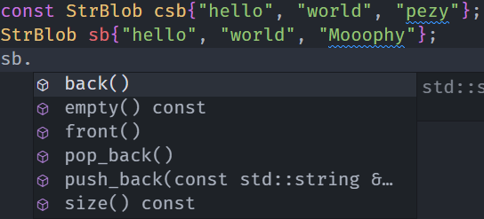
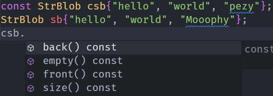

StrBlob 需要 const 版本的 push_back 和 pop_back 吗？
如果需要，添加进去。否则，解释为什么不需要。

> 答：不需要。因为在类的使用者角度而言，StrBlob 是一个 string 的 vector ，而非一个智能指针。所以对于一个 const 的 StrBlob ，其不应该支持 push_back 和 pop_back 。  
> 虽然对 const 的 StrBlob 使用 push_back 或 pop_back 都不会改变智能指针成员 data 的值，只是改变了指针所指对象的值，能够通过编译；但是从类的使用者看来，对 const 的 vector 执行 push_back 或 pop_back 是不符合逻辑的。
>  
>   
> 图中非 const 的 sb 支持 push_back 和 pop_back 。
>
>   
> 图中 const 的 csb 不支持 push_back 和 pop_back 。因为没有定义 const 版本的 push_back 和 pop_back 。
