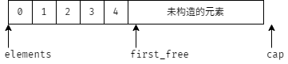

# 13.5 动态内存管理类

本节将使用 allocator 实现一个储存 string 的可变长的容器 StrVec 。

成员变量：

* `elements` ：指向分配的内存中的首元素
* `first_free` ：指向最后一个实际元素之后的位置
* `cap` ：指向分配的内存末尾之后的位置
* `alloc` ：类型为 `allocator<string>` 的内存分配器

成员函数：

* `alloc_n_copy` ：分配内存，并拷贝一个给定范围中的元素
* `free` ：销毁构造的元素并释放内存
* `chk_n_alloc` ：保证 StrVec 至少有容纳一个新元素的空间；如果没有空间添加新元素，则会调用 reallocate 来分配更多内存
* `reallocate` ：在内存用完时为 StrVec 分配新内存

## 练习

* [练习 13.39](../src/quiz_13.39.md)
* [练习 13.40](../src/quiz_13.40.md)
* [练习 13.41](../src/quiz_13.41.md)
* [练习 13.42](../src/quiz_13.42_main.cpp)
* [练习 13.43](../src/quiz_13.43.md)
* [练习 13.44](../src/quiz_13.44.hpp)
