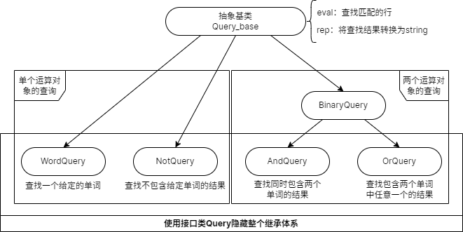
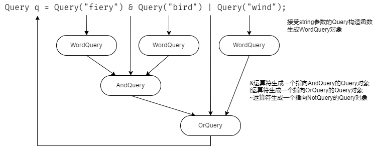

# 15.9 文本查询程序再探

## 15.9.1 面向对象的解决方案

继承体系的设计准则：

* 当 A 和 B 之间的关系是“是一种”时，应该是继承关系（ B 是一种 A ，那么 B 应该继承 A ）
* 当 A 和 B 之间的关系是“有一个”时，应该是成员关系（ A 有一个 B ，那么 B 是 A 的成员）

### 构建继承体系

### 使用表达式创建对象

## 练习

* [练习 15.31](../src/quiz_15.31.md)
