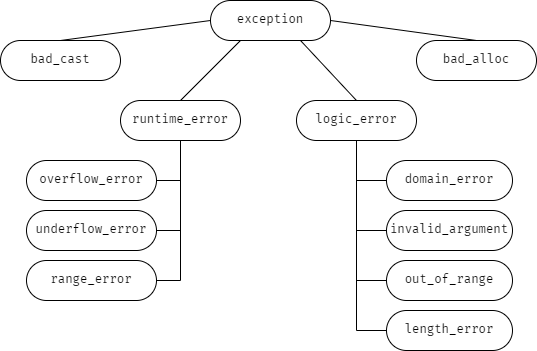

# 18.1 异常处理

> 本章术语：
>
> * 栈展开（stack unwinding）
> * 函数 try 语句块（function try block）：也称为函数测试块
> * noexcept 说明（noexcept specification）：指明某个函数不会抛出异常
> * noexcept 运算符（noexcept operator）：返回一个 bool 右值常量表达式，指明给定的表达式是否会抛出异常

## 18.1.1 抛出异常

throw 语句的用法有点类似于 return 语句。throw 后面的语句不会被执行，程序的控制权转移到与异常类型匹配的 catch 模块。

栈展开：当 throw 在 try 语句块中抛出异常时，先找与该 try 块关联的 catch 是否有匹配的异常类型；如果没有，就在外层的 try 语句块关联的 catch 中找；如果还没有，就退出当前函数，在外层函数的 catch 中找；直到退出了 main 函数，则程序终止。

栈展开的过程中当前函数的局部对象会自动销毁。

析构函数不应该抛出自身无法处理的异常。应该将可能抛出异常的操作放置在 try 语句块中，并且能在析构函数内部得到处理。

一旦在栈展开的过程中，析构函数抛出了异常，并且析构函数自身没能捕获到该异常，则程序将被终止。

throw 后面的表达式如果是类类型，则相应的类必须含有一个可访问的析构函数和一个可访问的拷贝或移动构造函数；如果是数组类型或函数类型，则表达式将被转换成与之对应的指针类型。

当异常处理完毕后，异常对象会被销毁。

抛出一个指向局部对象的指针几乎肯定是一种错误的行为。从函数中返回指向局部对象的指针也是错误的。

如果一条 throw 表达式解引用一个基类指针，而该指针实际指向的是派生类对象，则抛出的对象只有基类部分。

## 18.1.2 捕获异常

catch 子句中的异常声明类似于只包含一个参数的函数形参列表。如果 catch 无需访问 throw 抛出的表达式的话，可以省略形参列表中的参数名。

如果形参列表中的形参是非引用类型，则捕获到的对象是 throw 抛出对象的一个副本。如果形参是引用类型，则捕获到的对象就是 throw 抛出的对象。形参**不能**是右值引用。

如果 catch 的参数是基类类型，则可以使用派生类的基类部分进行初始化；如果 catch 的参数是基类的引用，则该参数以常规方式绑定到异常对象上。

*如果 catch 接受的异常与某个继承体系有关，则最好将该 catch 的参数定义成引用类型。*

catch 语句按照出现顺序逐一匹配，越是特例的 catch 越应该放在 catch 列表的前面。派生类异常的处理代码应该出现在基类异常的前面。

throw 抛出的表达式与 catch 语句形参允许的类型转换：

* 允许从非常量向常量的类型转换
* 允许从派生类向基类的类型转换
* 数组被转换成指向数组元素类型的指针，函数被转换成指向该函数类型的指针

除此之外，其他所有转换都不能在匹配 catch 的过程中使用。类型必须精确匹配。

在 catch 语句块中可以使用空的 throw 语句 `throw;` 重新抛出当前捕获的异常。该异常会由调用链上一层的 catch 语句捕获。  
在 catch 语句块之外使用空的 throw 语句，编译器会直接调用 terminate 结束程序。

只有 catch 的参数是引用类型时，重新抛出的异常才会保存之前的修改：

```cpp
catch (my_error &eObj) // 引用类型
{
    eObj.status = errCodes::severeErr; // 修改 eObj 对象
    throw; // 重新抛出的异常保存了上面的修改
}
catch (other_error eObj) // 非引用类型
{
    eObj.status = errCodes::badErr; // 只修改了局部副本
    throw; // 重新抛出的异常没有保存任何修改
}
```

一次性捕获所有异常：

```cpp
try
{
    // 抛出一个异常
}
catch (...) // 可以捕获任意类型的异常
{
    // 完成初步处理
    throw; // 重新抛出异常，用以进一步处理
}
```

*出现在捕获所有异常语句后面的 catch 语句将永远不会被匹配。*

## 18.1.3 函数 try 语句块与构造函数

构造函数体内的 catch 语句不能捕获构造函数初始值列表中发生的异常。

必须将构造函数写成函数 try 语句块的形式，才能处理构造函数初始值异常：

```cpp
template <typename T>
Blob<T>::Blob(std::initializer_list<T> il) try : data(std::make_shared<std::vector<T>>(il))
{
    /* 空函数体 */
}
catch (const std::bad_alloc &e)
{
    handle_out_of_memory(e);
}
```

try 在冒号前，形参列表后。catch 既能捕获初始值列表中抛出的异常，也能捕获构造函数体中抛出的异常。

## 18.1.4 noexcept 异常说明

预先知道某个函数不会抛出异常有如下好处：

* 知道函数不会抛出异常，有助于简化调用该函数的代码
* 如果编译器确认函数不会抛出异常，它就能执行某些特殊的优化操作，而这些优化操作不适用于可能出错的代码

`noexcept` 关键字位于函数的形参列表后面，在函数的尾置返回类型之前。
在成员函数中，`noexcept` 关键字在 const 和引用限定符之后，在 final 、override 或虚函数的 =0 之前。

`noexcept` 关键字必须出现在所有声明和定义中。

编译器不会在编译时验证函数是否违反 noexcept 异常声明。

如果 noexcept 的函数抛出了异常，那么程序就会调用 terminate 直接终止运行。

noexcept 的使用场景：

* 确认函数不会抛出异常
* 根本不知道该如何处理函数中可能发生的异常

```cpp
void recoup(int) noexcept; // 表示 recoup 不会抛出异常
void alloc(int);           // 表示 alloc 可能抛出异常

// 为 noexcept 提供一个可选的实参
void recoup(int) noexcept(true); // 表示 recoup 不会抛出异常
void alloc(int) noexcept(false); // 表示 alloc 可能抛出异常

// noexcept 运算符
noexcept(recoup(i)); // 返回 true ，表示 recoup 不会抛出异常
void g() noexcept(noexcept(f())); // g 与 f 的异常说明一致，内层 noexcept 是运算符，外层 noexcept 是说明符
```

noexcept 的两层含义：

1. 当跟在函数参数列表后面时，它是异常说明符
2. 当作为 noexcept 异常说明的 bool 实参出现时，它是一个运算符

不抛出异常的函数指针**只能**指向不抛出异常的函数；显式或隐式说明的可能抛出异常的函数指针可以指向**任意**函数。

```cpp
void (*pf1)(int) noexcept; // 不抛出异常的函数指针
void (*pf2)(int);          // 可能抛出异常的函数指针

pf1 = recoup; // 合法：都不抛出异常
pf1 = alloc;  // 非法：alloc 可能抛出异常

pf2 = recoup; // 合法：可以指向任意函数
pf2 = alloc;  // 合法：可以指向任意函数
```

如果一个虚函数承诺不抛出异常，那么后续派生出来的虚函数都必须同样承诺不抛出异常；  
如果虚函数不作出承诺，那么后续派生出来的虚函数允许抛出异常，也可以承诺不抛出异常。

当编译器合成拷贝控制成员时，如果合成的结果调用了任意一个可能抛出异常的成员，那么合成的拷贝控制成员是 `noexcept(false)` ；如果合成的结果中所有操作都不抛出异常，那么合成的拷贝控制成员也承诺不抛出异常。

编译器也会为没有异常说明符的析构函数合成一个异常说明符，合成的结果与让编译器合成析构函数时得到的异常说明符一致。

## 18.1.5 异常类层次



有默认构造函数和接受字符串的构造函数的类：

* exception
* bad_cast
* bad_alloc

没有默认构造函数但有接受字符串的构造函数的类：

* runtime_error
* logic_error

`what()` 成员函数负责返回用于初始化异常对象的信息。

## 练习

* [练习 18.1](../src/quiz_18.1.md)
* [练习 18.2](../src/quiz_18.2.md)
* [练习 18.3](../src/quiz_18.3.md)
* [练习 18.4](../src/quiz_18.4.md)
* [练习 18.5](../src/quiz_18.5.cpp)
* [练习 18.6](../src/quiz_18.6.md)
* [练习 18.7](../src/quiz_18.7.md)
* [练习 18.8](../src/quiz_18.8.md)
* [练习 18.9](../src/quiz_18.9.cpp)
* [练习 18.10](../src/quiz_18.10.cpp)
* [练习 18.11](../src/quiz_18.11.md)
